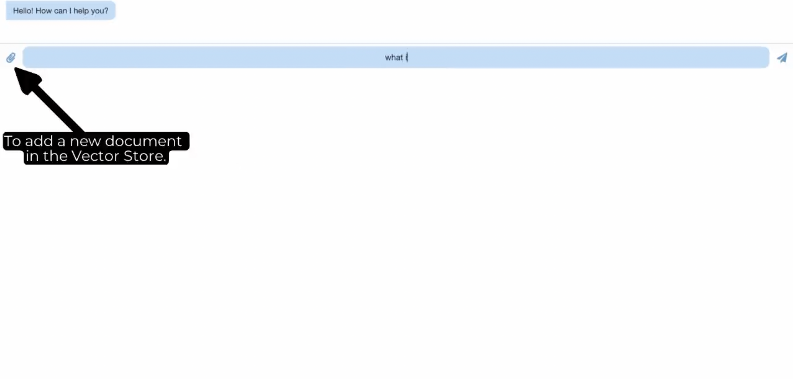

# Book Assistant Chatbot

A chatbot application that allows users to ask questions about a book, and it provides answers based on the book's content. The chatbot is built using FastAPI for the backend, Chatscope for the chat UI, and React for the frontend.

### Click on the image bellow to watch a demo:
<a href="https://youtu.be/EmZpadO355U" target="_blank">
  
</a>

## Features

* Natural language processing capabilities
* Book indexing and searching for relevant information
* Interactive chat UI with Chatscope

## Getting Started

### Prerequisites
* Python 3.7 or higher
* Node.js and npm
* FastAPI
* Uvicorn
* Pinecone
* OpenAI
* Chatscope
* Langchain
* Torch

### Installation
1. Clone the repo
   ```sh
   git clone https://github.com/naoufal51/book_assistant.git
   cd book_assistant
    ```
2. Create a virtual environment and install the required Python dependencies:
    ```sh
    python -m venv venv
    source venv/bin/activate  # On Windows, use `venv\Scripts\activate`
    pip install -r requirements.txt
     ```
3. Set the necessary environment variables:
    ```sh
    export PINECONE_API_KEY=<your Pinecone API key>
    export OPENAI_API_KEY=<your OpenAI API key>
    ```
4. Navigate to the frontend directory and install the required npm packages:
    ```sh
    cd frontend
    npm install
    ```
5. Create a Pinecone index called 'book-assistant' with 1536 dimensions (check [openai_embeddings](https://platform.openai.com/docs/guides/embeddings/what-are-embeddings))

### Usage
1. Start the backend server:
    ```sh
    cd ./api/book_assistant
    python main.py
    ```
2. Start the frontend server:
    ```sh
    cd ./frontend
    npm start
    ```
    Open http://localhost:3001 in your browser to view the chat UI.

3. Index a book by sending a PDF file by using the attachement in UI or using the following example command:
    ```sh
    curl -X POST -H "Content-Type: multipart/form-data" -F "pdf_file=@path/to/your/book.pdf" http://localhost:8001/index
    ```
    The server will respond with a message indicating that the document has been indexed successfully.


## License

Distributed under the MIT License. See `LICENSE` for more information.

## Contact

 

